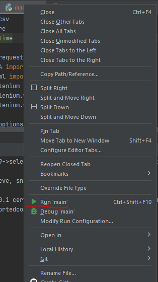
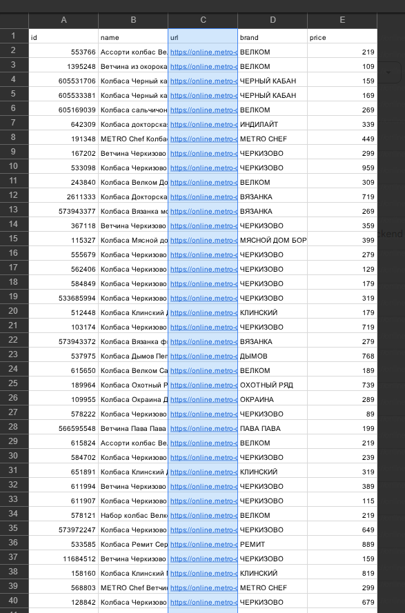

# parser_metro

1. Клонирование проекта: git clone https://github.com/OlzhasKALIEV/parser_metro.git
2. Перейти в проект cd ./parser_metro
3. Создать виртуальное окружение: python -m venv venv
4. Запустить виртуальное окружение: .\venv\Scripts\activate
5. Установка зависимостей: pip install -r .\requirements.txt
6. Запустить скрипт: 

